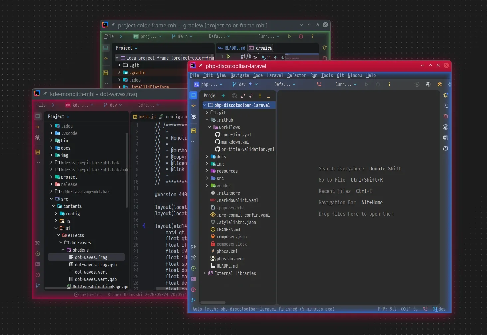
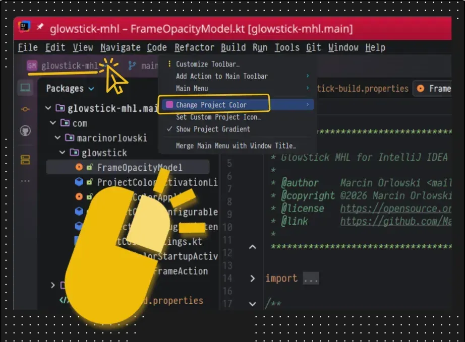
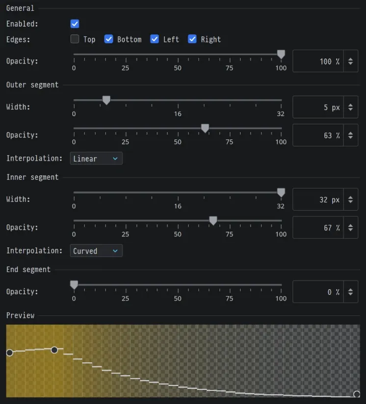

# GlowStick MHL for JetBrains IDEs

GlowStick is visual expansion plugin for IntelliJ IDEA based
IDEs that helps you visually distinct each IDE window per project
which allows instant visual identification and navigation
across your projects.

## Features:

- Draws colorful frame around the IDE window for opened project,
- Colors configurable per-project in IDE settings,
- Visuals can be customized on per-project basis,
- Configurable frame profile with segments and opacity gradients,

## Usage:

- Set project color in IDE's project settings panel - locate project widget
  on your toolbar, thne press right mouse button over it open context menu and
  use `Change Project Color` option to set your color:

## Settings

You can tweak plugin settings by going to `Settings` dialog, then to
`Appearance & Behavior` section and open `GlowStick Frame` pane:

Preview shows the real alpha distribution reflecting current settings.

### Available options:

#### General section

* `Enabled` - enable/disable color frame drawing per-project basis,
* `Edges` - which window edges should be colored,
* `Opacity` - master opacity for the drawn frame,

#### Per segment

* `Width` - set frame segment's width in pixels,
* `Opacity` - opacity of the frame in percents,
* `Interpolation` - choose function to provide opacity gradient.

Aside from using knobs and sliders to tweak your frame shape, you can also drag
the handles on the preview idea.

## License

* Written and copyrighted &copy;2026 by Marcin Orlowski <mail (#) marcinorlowski (.) com>
* GlowStick MHL is open-source software licensed under the
  [MIT license](http://opensource.org/licenses/MIT)
