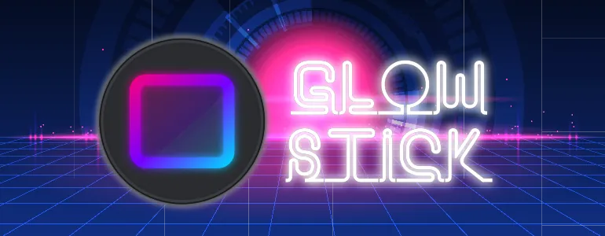

# Artwork credits

Here are all the artwork credits where they are due:

* Project logo by Marcin Orlowski, licensed under
  [CC BY 4.0](https://creativecommons.org/licenses/by/4.0/)
* Font used in project's banner is [EB Neon Regular](https://www.dafont.com/neon.font)
* Cyberpunk stylized [background artwork](https://www.vecteezy.com/vector-art/1229462-abstract-futuristic-technology-design-with-perspective-grid)
  by [Passakorn Prothien](https://www.vecteezy.com/members/pprothien-video)
* Mouse vector shapes by [lavamsg](https://www.vecteezy.com/members/lavarmsg)
  from [Vecteezy](https://www.vecteezy.com/vector-art/104904-mouse-click-vector-set)
* [Mouse pointer vector](https://www.svgrepo.com/svg/226261/cursor-pointer) provided
  by [SVGRepo](https://www.svgrepo.com/svg/226261/cursor-pointer)
